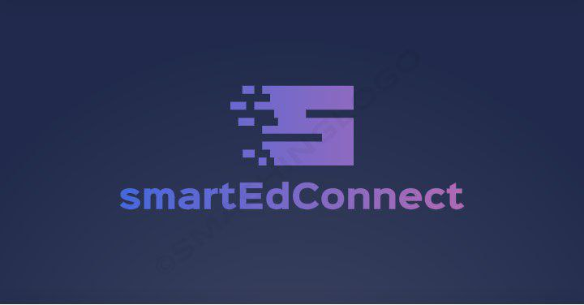

<a name="readme-top"></a>

<div align="center">
  
  
  <br/>

  <h3><b>smartEdConnect School Management System </b></h3>

</div>

<!-- TABLE OF CONTENTS -->

# 📗 Table of Contents

- [📖 About the Project](#about-project)
  - [🛠 Built With](#built-with)
    - [Tech Stack](#tech-stack)
    - [Key Features](#key-features)
  - [🚀 Live Demo](#live-demo)
- [💻 Getting Started](#getting-started)
  - [Prerequisites](#prerequisites)
  - [Setup](#setup)
  - [Install](#install)
  - [Usage](#usage)
  <!-- - [Run tests](#run-tests) -->
  - [Deployment](#deployment)
- [👥 Authors](#authors)
- [🔭 Future Features](#future-features)
  <!-- - [🤝 Contributing](#contributing) -->
  <!-- - [⭐️ Show your support](#support) -->
  <!-- - [🙏 Acknowledgements](#acknowledgements) -->
  <!-- - [❓ FAQ (OPTIONAL)](#faq) -->
  <!-- - [📝 License](#license) -->

<!-- PROJECT DESCRIPTION -->

# 📖 [smartEdConnect] <a name="about-project"></a>

smartEdConnect is a school management system designed to revolutionize how educational institutions manage their administrative and educational processess

## 🛠 Built With <a name="built-with"></a>

### Tech Stack <a name="tech-stack"></a>

<details>
  <summary>Client</summary>
  <ul>
    <li><a href="https://reactjs.org/">React.js</a></li>
    <li>Tailwind css</li>
  </ul>
</details>

<details>
  <summary>Server</summary>
  <ul>
    <li>Django</li>
    <li>SQLite</li>
  </ul>
</details>

<details>
<summary>Database</summary>
  <ul>
    <li><a href="https://www.postgresql.org/">PostgreSQL</a></li>
  </ul>
</details>

<!-- Features -->

### Key Features <a name="key-features"></a>

> Describe between 1-3 key features of the application.

- School information management
- User and access management
- Departments management

<p align="right">(<a href="#readme-top">back to top</a>)</p>

<!-- LIVE DEMO -->

## 🚀 Live Demo <a name="live-demo"></a>

- [Live Demo Link](https://smartedconnect.netlify.app/)

<p align="right">(<a href="#readme-top">back to top</a>)</p>

<!-- GETTING STARTED -->

## 💻 Getting Started <a name="getting-started"></a>

To get a local copy up and running, follow these steps.

### Prerequisites

In order to run this project you need:

<!--
Example command:

```sh
 gem install rails
```
 -->

 <ul>
 <li>npm</li>
 <li>node</li>
 <li>python</li>
 <li>django</li>
 </ul>

### Setup

Clone this repository to your desired folder:

```sh
  cd my-folder
  git clone git@github.com:obaraelijah/school-management-system.git
```

### Install

Install this project with:

<!--
Example command:

```sh
  cd my-project
  gem install
```
--->

- Backend

- Frontend

```sh
  cd frontend
  npm install
```

### Usage

To run the project, execute the following command:

- Frontend

```sh
  npm run dev
```

<!--
### Run tests

To run tests, run the following command: -->

<!--
Example command:

```sh
  bin/rails test test/models/article_test.rb
```
--->

### Deployment

You can deploy this project using:

<!--
Example:

```sh

```
 -->

```sh
  npm run build
```

<p align="right">(<a href="#readme-top">back to top</a>)</p>

<!-- AUTHORS -->

## 👥 Authors <a name="authors"></a>

👤 **Abiola Adeshina**

- GitHub: [@Abiorh001](https://github.com/Abiorh001)

👤 **Elijah Samson**

- GitHub: [@obaraelijah](https://github.com/obaraelijah)

👤 **Efezino Idisi**

- GitHub: [@efezinoidisi](https://github.com/efezinoidisi)

👤 **Samuel Ng'ang'a**

- GitHub: [@Sammie2022](https://github.com/Sammie2022)

<p align="right">(<a href="#readme-top">back to top</a>)</p>

<!-- FUTURE FEATURES -->

<!-- ## 🔭 Future Features <a name="future-features"></a>

> Describe 1 - 3 features you will add to the project.

- [ ] **[new_feature_1]**
- [ ] **[new_feature_2]**
- [ ] **[new_feature_3]**

<p align="right">(<a href="#readme-top">back to top</a>)</p> -->

<!-- CONTRIBUTING -->

<!-- ## 🤝 Contributing <a name="contributing"></a>

Contributions, issues, and feature requests are welcome!

Feel free to check the [issues page](../../issues/).

<p align="right">(<a href="#readme-top">back to top</a>)</p> -->

<!-- SUPPORT -->

<!-- ## ⭐️ Show your support <a name="support"></a>

> Write a message to encourage readers to support your project

If you like this project...

<p align="right">(<a href="#readme-top">back to top</a>)</p> -->

<!-- ACKNOWLEDGEMENTS -->

<!-- ## 🙏 Acknowledgments <a name="acknowledgements"></a>

> Give credit to everyone who inspired your codebase.

I would like to thank...

<p align="right">(<a href="#readme-top">back to top</a>)</p> -->

<!-- FAQ (optional) -->

<!-- ## ❓ FAQ (OPTIONAL) <a name="faq"></a>

> Add at least 2 questions new developers would ask when they decide to use your project.

- **[Question_1]**

  - [Answer_1]

- **[Question_2]**

  - [Answer_2]

<p align="right">(<a href="#readme-top">back to top</a>)</p> -->

<!-- LICENSE -->
<!--
## 📝 License <a name="license"></a>

This project is [MIT](./LICENSE) licensed.

_NOTE: we recommend using the [MIT license](https://choosealicense.com/licenses/mit/) - you can set it up quickly by [using templates available on GitHub](https://docs.github.com/en/communities/setting-up-your-project-for-healthy-contributions/adding-a-license-to-a-repository). You can also use [any other license](https://choosealicense.com/licenses/) if you wish._

<p align="right">(<a href="#readme-top">back to top</a>)</p> -->
